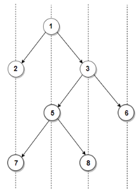

<<<<<<< HEAD
# Project_DSA_2024.1
This is project of Data Structure and Algorithms 2024.1
=======
# MÔ TẢ GIẢI THUẬT VÀ VIẾT MÃ GIẢ 
Bài tập lớn môn Cấu trúc dữ liệu và giải thuật
Họ và tên: Nguyễn Trần Phong
Mã số sinh viên: 20224449

# BÀI TOÁN: IN RA “GÓC NHÌN” CỦA CÂY NHỊ PHÂN VỚI ĐIỂM NHÌN TỪ DƯỚI LÊN
## 1. Đề bài và test case:
1.1 Đề bài:
-	Cho một cây nhị phân, giả sử là với mỗi node con bên trái và bên phải tạo với gốc cha thành một góc 45 độ. Nếu ta nhìn từ dưới nhìn lên thì ta sẽ nhìn được những node nào.
-	Link nguồn của bài toán tại đây. https://www.techiedelight.com/print-bottom-view-of-binary-tree/
1.2 Test case:

Output: 7 5 8 6
Giải thích: ta sẽ thấy rằng số 7 sẽ che đi số 2, số 5 che số 1, 8 che số 3.
Ngoài ra thì 7, 5, 8, 6 thì không bị che đi bởi bất kì giá trị nào nên nếu nhìn từ dưới lên thì dãy đó chính là đáp án.

## 2. Phân tích bài toán:
-	Trong bài toán này để đơn giản hoá thì chúng ta cần phải tạo ra các đường thẳng “vô hình” được khởi tạo mỗi khi ta nhập một node mới và khởi sinh ra các đường thẳng nếu mà tại vị trí đó thì chưa có tồn tại đường thẳng. Công việc của ta khi làm được điều này đó chính là đi lấy các giá trị ngoài cùng của các đường thẳng chính là đáp án cần tìm được.

## 3. Xây dựng phương hướng giải quyết:
-	Tại mỗi một điểm được sinh ra, ta sẽ kiểm tra xem đã tồn tại các đường thẳng cần thiết chưa. Nếu chưa thì hãy khởi tạo và gán luôn giá trị trên cùng là node đó. Điều này sẽ khởi tạo đúng chính xác giá trị đầu tiên. Trong trường hợp mà đường thẳng đã có rồi thì ta sẽ update giá trị ngoài cùng là giá trị hiện tại. Do cái đằng sau sẽ luôn bao phủ đằng trước
-	Tiếp theo khi khởi tạo các node con bên trái, hay bên phải thì ta cũng sẻ kiểm tra các đường thằng đã tồn tại chưa. Xác định vị trí của đường thằng bằng cách ta lấy vị trí của node cha cộng 1 nếu sang trái hoặc trừ 1 nếu sang phải. Khi này thì ta sẽ áp dụng y như khi tạo điểm
-	Cứ chạy y như vậy cho tới khi hết các node thì chúng ta sẽ giải quyết được bài toán
 
## 4. Đánh giá độ phức tạp của thuật toán:
-	Độ phức tạp thuật toán: O(N) do ta chỉ duyệt tuyến tính các node, không có lặp lại.
-	Độ phức tạp lưu trữ: O(N) cần lưu trữ cây và một ít các biến lưu các đường thẳng cần thiết. Trong trường hợp tổng quát thì nó không đáng kể, ta có thể bỏ qua

## 5. Mã giả của giải thuật

FUNCTION printBottomView(root):
    IF root IS NULL:
        RETURN

    // Initialize a queue for BFS
    INITIALIZE queue AS empty
    INITIALIZE map AS empty dictionary to store (dist -> (value, level))

    // Add the root node to the queue with dist = 0, level = 0
    ENQUEUE(queue, (root, dist = 0, level = 0))

    WHILE queue IS NOT EMPTY:
        // Dequeue a node from the queue
        node, dist, level = DEQUEUE(queue)

        // Update the map
        IF dist EXISTS in map:
            IF level >= map[dist].level:
                UPDATE map[dist] TO (node.value, level)
        ELSE:
            ADD (dist -> (node.value, level)) TO map

        // Add the left child to the queue
        IF node.left IS NOT NULL:
            ENQUEUE(queue, (node.left, dist - 1, level + 1))

        // Add the right child to the queue
        IF node.right IS NOT NULL:
            ENQUEUE(queue, (node.right, dist + 1, level + 1))

    // Sort the map by horizontal distance (dist)
    SORT the map by dist in ascending order

    // Print the values in the map
    FOR EACH (dist, (value, level)) IN sorted map:
        PRINT value

GIẢI THÍCH TỪNG BƯỚC TRONG MÃ GIẢ
1. Kiểm tra cây rỗng:

Nếu cây không tồn tại (root == NULL), không có gì để in, nên trả về.

2. Khởi tạo hàng đợi:

Hàng đợi (queue) để lưu các node và thông tin bổ sung:
node: con trỏ đến node hiện tại.
dist: khoảng cách ngang so với gốc cây.
level: độ sâu của node trong cây.

3. Khởi tạo bản đồ:

Bản đồ (map) để lưu trữ thông tin:
dist: khoảng cách ngang.
(value, level): giá trị của node và độ sâu.

4.Duyệt cây sử dụng BFS:

Xử lý lần lượt từng node trong hàng đợi.
Tại mỗi bước:
Cập nhật bản đồ:
Nếu khoảng cách ngang (dist) đã tồn tại, chỉ ghi đè nếu độ sâu của node hiện tại lớn hơn hoặc bằng node trước đó.
Nếu khoảng cách ngang chưa tồn tại, thêm mới vào bản đồ.
Thêm con trái vào hàng đợi với khoảng cách ngang dist - 1.
Thêm con phải vào hàng đợi với khoảng cách ngang dist + 1.
Sắp xếp và in kết quả:

5. Sắp xếp các phần tử trong bản đồ theo dist.

In các giá trị (value) từ bản đồ theo thứ tự khoảng cách ngang tăng dần.

>>>>>>> b633aa9 (Project DSA 2024.1)
